# MIT_6.175_6.375_Lab
MIT 6.004 6.175 6.375 course, notes, Lab and Project. digital design and computer architecture.

## 6.175_Lab1

Lab 1: [Multiplexers and Adders](http://csg.csail.mit.edu/6.175/archive/2016/labs/lab1-multiplexers-adders.html) 

```
多路复用器和加法器
学习BSV数据结构、基本语法和function
RC = Ripple Carry ; CS = Carry Select
```

### 类型类

| 类型类         | 说明                                                         |
| -------------- | ------------------------------------------------------------ |
| `Bits`         | 派生出的类型的变量可以用 `pack()` 函数转换为位向量（`Bit#(n)`类型）；反之，位向量也可以用 `unpack()` 函数转换为该类型的变量。 |
| `Eq`           | 派生出的类型的变量之间可以判断是否相等。        |
| `Bitwise`      | 派生出的类型的变量之间可以进行按位运算（与、或、非等）。     |
| `BitReduction` | 派生出的类型的变量可以进行逐位合并运算来产生1位的结果（类比Verilog中的 \|a 写法）。 |
| `BitExtend`    | 派生出的类型的变量可以进行位扩展操作。                       |
|…… 			 |…… |


> 📌 BSV 的类型类就像 C++ 中的虚类 (virtual class)。类可以派生自多个虚类，这在C++中叫做“多继承/多派生”。

例如，以下代码自定义了一个**结构体** (stuct) 类型，用来表示以太帧报头，类型名为 `EthHeader`，它派生自 `Bits` 和 `Eq` 类型类。

```
typedef struct {
   UInt#(48) dst_mac;     // 成员变量1：目的地址
   UInt#(48) src_mac;     // 成员变量2：源地址
   UInt#(16) pkt_type;    // 成员变量3：帧类型
} EthHeader deriving(Bits, Eq);  // 派生自的类型类是 Bits 和 Eq
```


对于 `EthHeader` 类型的两个变量：

```
EthHeader hdr1 = EthHeader{dst_mac: 'h0123456789AB, src_mac: 'h456789ABCDEF, pkt_type: 'h0800};
EthHeader hdr2 = EthHeader{dst_mac: 'h0123456789AB, src_mac: 'h456789ABCDEF, pkt_type: 'h0860};
```


因为派生自 `Eq` 类型类，可以用 `==` 判断它们是否相等：

```
hdr1 == hdr2   // 若相等，该语句返回 True，否则返回 False
               // 只有当3个成员变量都相等时，才返回 True
```


又因为派生自 `Bits` 类型类，可以用 `pack()` 函数来把它转换为 `Bit#(112)` 类型的变量，也即把三个成员变量拼接成一个 112 位的向量：

```
Bit#(112) bits = pack(hdr1);  //结构体的成员变量共占 48+48+16=112 位
```


> 📌 `Bits` 是最重要的类型类，只有派生自 Bits 的类型的变量作为寄存器、FIFO、或存储器内的值时，才是**可综合**的。因为硬件中本质上都是位向量的逻辑运算。

BSV 中常用的类型转换函数如**表3**。注意 ：如果代码中包含过多类型转换，表明类型设计或选择不佳，我们应该精心设计数据类型（例如数据向量类型、CAN总线帧类型等），让代码变得可读、可维护。

 **表3**：BSV 中的类型转换函数一览。

| 函数名       | 类型类      | 说明                                                         |
| ------------ | ----------- | ------------------------------------------------------------ |
| `pack`       | `Bits`      | 把派生自 `Bits` 类型类的类型的变量转化为位向量，也即`Bit#(n)`类型。 |
| `unpack`     | `Bits`      | 把位向量转化为派生自 `Bits` 类型类的类型，具体是什么类型，取决于 `=` 左值的类型。 |
| `truncate`   | `BitExtend` | 高位截断，比如把 Int#(32) 截断为 Int#(16) 。具体截断为多少位，取决于 `=` 左值的类型。 |
| `zeroExtend` | `BitExtend` | 高位补零扩展，比如把 UInt#(16) 扩展为 UInt#(32) 。具体扩展为多少位，取决于 `=` 左值的类型。 |
| `signExtend` | `BitExtend` | 高位符号扩展，比如把 Int#(16) 扩展为 Int#(32) 。具体扩展为多少位，取决于 `=` 左值的类型。 |
| `extend`     | `BitExtend` | 高位扩展，根据类型自动选择采用 `zeroExtend` 还是 `signExtend` |

### 基本数据类型

BSV 预定义的几种类型。它们都派生自 `Bits` 类型类，因此可以作为寄存器、FIFO、或存储器内的值，我们称之为**可综合数据类型**。

1. Bit#(n)类型：n位向量

   📌 Bit#(n) 是一个多态类型（泛型），而 Bit#(7) 和 Bit#(4) 完全不是一种数据类型，这也解释了为什么 BSV 必须进行显式截断和扩展。

2. UInt#(n)类型：n位无符号数 `0~2^n-1` ;不能进行位下标选择和位拼接

3. Int#(n)类型：n位有符号数 `-2^(n-1) ~ 2^(n-1)`

4. Bool 类型：`True` 和 `False` 

### Interger与String类型

不派生自 `Bits` 类型类的类型，它们不能作为寄存器、FIFO 或存储器中的取值。

`Integer` 类型派生自 `Arith` 类型类，是数学上的整数，是无界的，对他进行算术运算永远不会溢出，不像 `UInt#(n)` 和 `Int#(n)` 是有界的。`Integer` 可以用于仿真，也可在可综合电路中作为循环下标。

`String` 类型表示一个字符串，一般用作仿真打印、指定仿真文件名等作用。 `String` 具有不定的长度，可以使用 `+` 拼接，比如：

### 变量定义与赋值

- 变量定义

```
类型名 变量名;
```

可以在变量定义时为它赋值，称作“初始化”

- 赋值

- 值赋值 (`=`) ：左边的变量（左值）被绑定到右边的值（右值），成为右值的一个副本。
- 副作用赋值 (`<-`) ：右值会引起副作用，包括实例化了一个硬件实体、或引起了硬件状态（寄存器、触发器）的变化。例如：
  - 实例化了一个模块并用 `<-` 获得其接口；
  - 调用一个动作值方法 (ActionValue method) 并用 `<-` 获得其返回值

义变量并赋初始值时，如果右值的类型可以被编译器推断出来，则左值的类型名可以省略，用 `let` 关键字代替。


### function

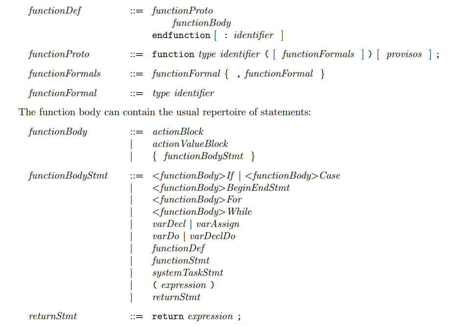

## 6.175_Lab2

Lab 2: [Multipliers](http://csg.csail.mit.edu/6.175/archive/2016/labs/lab2-multipliers.html)

```
n位乘法器（使用加法器纯组合逻辑实现）
folded 乘法器（使用加法器和触发器实现，fold以时间换空间）
时序电路设计
rule 规则 guard
Radix-4 Booth 乘法器
```

### 寄存器Reg

- 接口`Reg#()` 以及其配套的模块 `mkReg` 、 `mkRegU` 、 `mkDReg`

`mkReg` 和 `mkRegU` 都是模块名，用来实例化寄存器，唯一的区别是 `mkRegU` 的初始值未知（dont-care，可能是0或1），转化成 Verilog 后，你会发现 `mkReg` 定义的寄存器会在同步复位信号 `RST_N` 的控制下恢复默认值，而 `mkRegU` 不会。

```
Reg#(int) x <- mkReg(23);  //初值=23
Reg#(int) y <- mkRegU;     //初值未知
```


`Reg#()` 是个多态接口，其定义为：

```
interface Reg#(type td);         // 寄存器中存储的数据的类型名为 td ，可能是任何类型
   method Action _write (td x);  // 该方法用于把 td 类型的变量 x 写入寄存器
   method td _read;              // 该方法用于读出寄存器的值，得到 td 类型的返回值
endinterface
```

而 `mkReg` 的模块定义为：

```
module mkReg#(td v) (Reg#(td))  // 第一个括号里是模块参数，是一个类型为 td 的变量 v ，这里是作为寄存器初始值。
                                // 第二个括号里，表示 mkReg 具有 Reg#(td) 类型的接口
   provisos (Bits#(td, sz));    // 要求 td 派生自 Bits 类型类，即寄存器的值必须有特定的位宽（保证寄存器可综合）
```


以上 `interface Reg#(type td)` 的定义中有两个方法： `_write` 和 `_read`，其中 `_write` 方法用于写入寄存器；`_read` 方法用于读寄存器 。

```
x <= x + 1;                // 简化写法，等效于 x._write( x._read + 1 );
$display ("x=%d", x );     // 简化写法，等效于 $display ("x=%d", x._read );
```

`mkDReg` 只在写入后的下一个周期读出写入的值，其余周期都会读出默认值。也就是说： `mkDReg` 只能保留一周期的写入结果。


### 规则rule

激活 fire

**瞬时性**一方面是指单个规则是瞬时完成的；另一方面是指在同一个周期执行的多个规则合起来也是瞬时完成的。**瞬时性**是同步数字逻辑模型所带来的抽象。

规则还有**原子性**：如果规则激活，则规则内的所有语句都执行。如果规则不激活，则整个规则的所有语句都不执行。不存在一部分语句执行，另一部分不执行的情况。


### Radix-4 Booth 乘法器

|Current Bits | Previous Bit | Original Booth Encoding | Radix-4 Booth Encoding|
| ---- | ---- | ---- | ---- |
​    00       |      0       |           00            |         00  
​    00       |      1       |           0+            |         0+  
​    01       |      0       |           +-             |         0+
​    01       |      1       |           +0            |         +0  
​    10       |      0       |           -0             |         -0  
​    10       |      1       |           -+             |         0-  
​    11       |      0       |           0-             |         0-  
​    11       |      1       |           00            |         00  


## 6.175_Lab3

Lab 3: [FFT Pipeline](http://csg.csail.mit.edu/6.175/archive/2016/labs/lab3-fft.html) 

```
FFT(Combinational)
Folded FFT
InelasticPipeline FFT (Registers)
ElasticPipeline FFT (FIFOs)
```


## 6.175_Lab4

Lab 4: [N-Element FIFOs](http://csg.csail.mit.edu/6.175/archive/2016/labs/lab4-fifo.html) 

```
Conflict FIFO

Ehr寄存器

规则调度

Pipeline FIFO （Pipeline FIFO 在为满时支持并发 enq 与 deq ）
	 {notEmpty, first, deq} < {notFull, enq} < clear
	 
Bypass FIFO（BypassFIFO 在为空时支持并发 enq 与 deq ）
	 {notFull, enq} < {notEmpty, first, deq} < clear

Conflict free FIFO
	 {notFull, enq} CF {notEmpty, first, deq}
     {notFull, enq, notEmpty, first, deq} < clear

```


`Maybe#(td)` 是 BSV 预定义的一种多态类型，他能给任意类型（设类型名为 `td`）的数据附加上“是否有效”的信息。

以下代码中，我们定义两个 Maybe 类型的变量，它们中的数据类型都是 `Int#(9)` ，一个无效，一个有效：

```
Maybe#(Int#(9)) value1 = tagged Invalid;    // 无效
Maybe#(Int#(9)) value2 = tagged Valid 42;   // 有效，取值为 42
```


BSV 针对 `Maybe#(td)` 类型提供了两个函数：

- `isValid(x)` : 接受 `Maybe#(td)` 类型的变量 `x` 作为参数：
  - `x` 无效则返回 False
  - `x` 有效则返回 True
- `fromMaybe(dv, x)` : 接受 `td` 类型的变量 `dv` 和 `Maybe#(td)` 类型的变量 `x` 作为参数：
  - `x` 无效则返回 `dv`
  - `x` 有效则返回 `x` 中的取值。

使用例：

```
let v1 = isValid(value1);           // 得到 v1 是 Bool 类型的 False
let d1 = fromMaybe(-99, value1);    // 得到 d1 是 Int#(9) 类型的 -99
let v2 = isValid(value2);           // 得到 v2 是 Bool 类型的 True
let d2 = fromMaybe(-99, value2);    // 得到 d2 是 Int#(9) 类型的 42
```


## 6.175_Lab5

Lab 5: [Riscv introduction](http://csg.csail.mit.edu/6.175/labs/lab5-riscv-intro.html)

```
Onecycle procesoor
Multi-Cycle procesoor
Two-Stage Pipeline procesoor
```


```verilog
IType {
	Unsupported,
	Alu,
	Ld,
	St,
	J,
	Jr,
	Br,
	Csrr,
	Csrw,
	Auipc
}

BrFunc{
    Eq,
    Neq,
    Lt,
    Ltu,
    Ge,
    Geu,
    AT,
    NT
}

AluFunc{
    Add,
    Sub,
    And,
    Or,
    Xor,
    Slt,
    Sltu,
    Sll,
    Sra,
    Srl
}

Redirect{
    Addr pc;
    Addr nextPc;
    IType brType;
    Bool taken;
    Bool mispredict;
}

DecodedInst{
    IType itype;
    AluFunc aluFunc;
    BrFunc brFunc;
    Maybe#(RIndx) dst;
    Maybe#(RIndx) src1;
    Maybe#(RIndx) src2;
    Maybe#(CsrIndx) csr;
    Maybe#(Data)  imm ;
}

ExecInst{
    IType           iType;
    Maybe#(RIndx)   dst;
    Maybe#(CsrIndx) csr;
    Data            data;
    Addr			addr;
    Bool			mispredict;
    Bool			brTaken;
}

```


pipline processor

_hazards_

- _Control Hazards_ : We do not really know the next instruction to fetch until we have at least decoded the current instruction. If the decoded instruction is not a branch instruction, the next instruction is likely to be at PC+4. If it is a branch instruction,we may not know the new PC until the end of the Execute stage. Even if it is not a branch instruction, it may raise an trap/exception later in the pipeline (such as divide by-zero, or page fault), requiring the next instruction to be from a trap/exception handler.
- _Structural Hazard_ : Two instructions in the pipeline may require the same resource at the same time. For example, in Princeton architectures, both the Fetch and the Execute stages need to access the same memory.
- _Data Hazard_ : For example, if one instruction writes into register 13, a later instruction that reads register 13 must wait until the data has been computed and is available. In general, when different stages of the pipeline read and write common state (the register file being just one example), we must be careful about the order of reads and writes.


_Distributed Systems_

1. There is no instantly visible or updatable global state. Entities only have local state, and they can only send and receive messages to other entities too query or update remote state.
2. Messages cannot be delivered instantaneously; there is a discernable latency, and this latency may be variable and unpredictable.
3. Even between the same two enties, messages may get reorderd, i.e., they may arrive in an order different from the order in which they were sent.
4. Messages may get dropped , spuriously generated, duplicated, or corrupted alone the way. 

> Modern chip designers also talk about \GALS" methodology (Globally Asynchronous, Locally Synchronous), and this is just another manifestation of the same observation. Modern system-level communication protocols, such as PCI Express and Intel’s Quick Path Interconnect (QPI) even deal with the complexities of unreliable message delivery (bullet items 3 and 4 above).  


**Data Hazards**

- Read-after-write (RAW) Hazards and Scoreboards

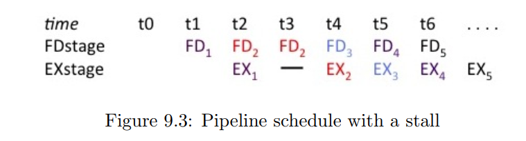


	- Keep a pending list of the names of those registers which will be written by instructions that are still ahead in the pipeline (in the Execute stage). When an instruction enters the Execute stage we enter its destination in this list; when the instruction completes, we remove this entry.
	- Stall the Decode stage when it has an instruction with a RAW hazard, i.e., whose source registers are in the pending list.


- Write-after-Write (WAW) hazard  
- Write-after-Read (WAR) Hazard

寄存器重命名


## 6.175_Lab6

Lab 6: [Riscv pipelined](http://csg.csail.mit.edu/6.175/labs/lab6-riscv-pipeline.html)

```
Six-Stage Pipeline processer 
Branch Prediction
	BTB
	BHT
	RAS
```

- six stage

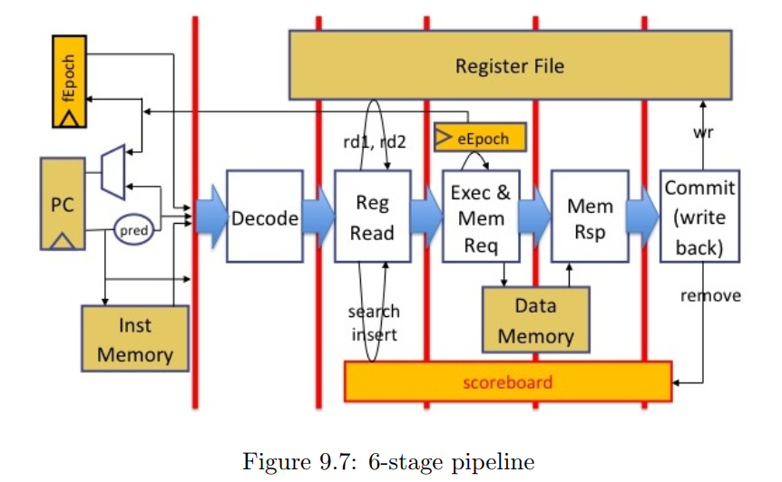


Fetch -> Decode -> Reg Read -> Exec -> Memory -> WriteBack

取指 -> 译码 -> 读寄存器 -> 执行 -> 访存 -> 回写


- control flow prediction


- BTB(Branch Target Buffer)

k bits are used for the index table

store the remaining 32-k bits of the PC in the table as a tag

only update the table with entries for actual branch instructions

update an entry we set its valid bit to True

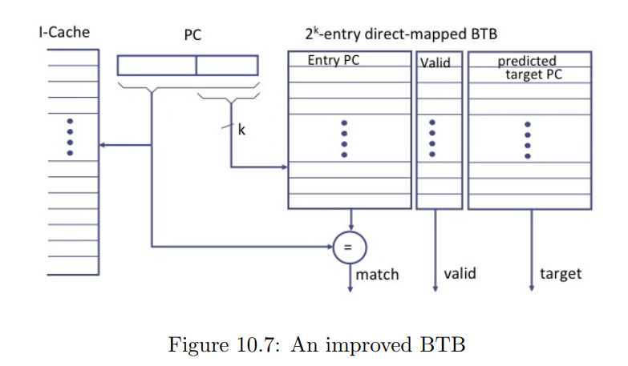

- BHT(Branch History Table)

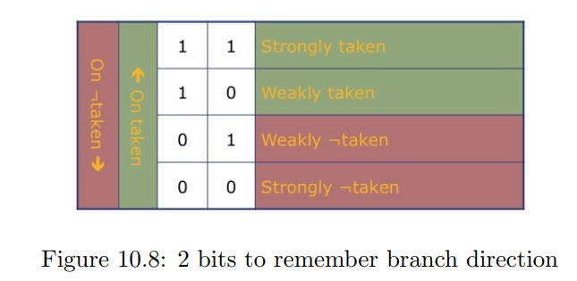

2-bit saturating counter(两位饱和计数器)


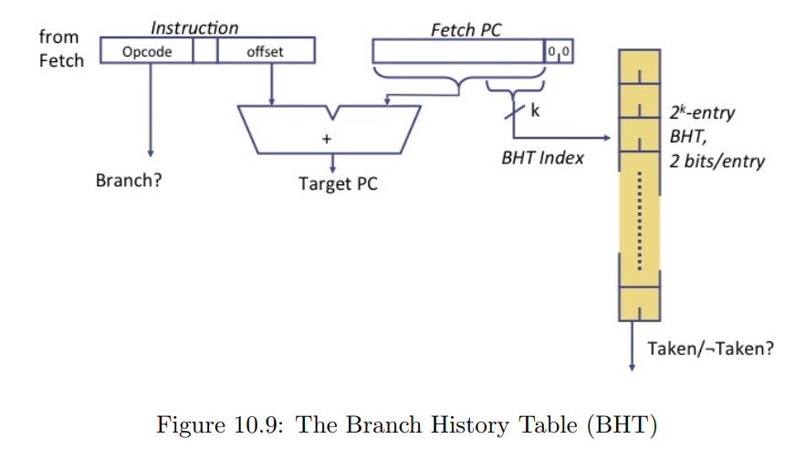

use k bits of the PC to index the table

use tags(the remaining 32 - k bits of the PC) to disambiguate due to _aliasing_

(In practice a 4K-entry BHT, with 2 bits per entry, can produce 80%-90% correct predictions.)


- RAS(Return Address Stack)


push the RAS for JAL/JALR instruction with `rd=x1`

pop the RAS for JALR instruction with `rd=x0` and `rs1=x1`.


## 6.175_Lab7

Lab 7: [Riscv caches](http://csg.csail.mit.edu/6.175/labs/lab7-riscv-caches.html)

```
RISC-V Processor with DRAM and Caches
```


- memory_hierarchy

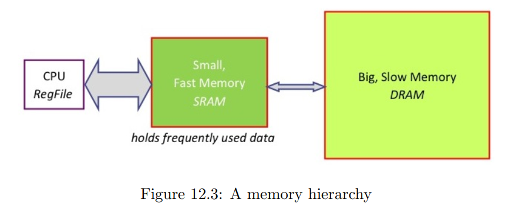

it is infeasible to build a memory that is simultaneous large(capacity), fast(access time) and consumes low power.


```
spatial locality: if a program accesses an address A, it is likely to access nearby address(think of successive elements in an array, or fields in a struct, or sequences of instructions in instruction memory)

temporal locality : much data is accessed more than once within a short time window(think of an index variable in a loop)
```


- Write an address(is cached)

_Write-through_(写直通) :  update it in the cache, also immediately send a message to the backing memory to update its original copy

_Writeback_(写回) : postpone updating the original location in backing memory until this address must be ejected from the cache

- Write an address(is not cached)

_Write-allocate_ (写分配): first bring the location into the cache and update it locally

_Write-no-allocate_ (写不分配) or _Write-around_ : just send the write to backing memory


直接映射与N路组相联

- _Direct-Mapped caches_ only use direct addressing.
- _N-way Set-Associative caches_ use some of the address bits directly to access the cache memory. However, the addressed location is wide enough to hold N entries, which are searched associatively.


- direct-mapped cache

 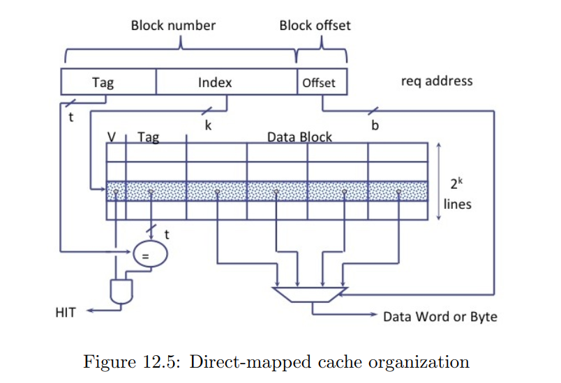

_k_ bits (called the Index field) of the original address directly to address $2^k$ locations of the cache memory.

In that entry, check the Valid bit (V) ; if invalid, the entry is empty, miss.

If full, compare the _t_ bits of the Tag field of the address.

If hit, use the _b_ bits of the Offset field of the original address to extract the relevant byte(s) of the cache line.


- 2-way set-associative cache

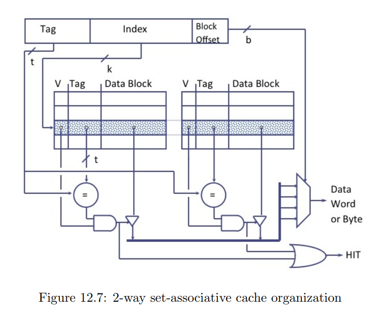

 it is conceptually like two direct-mapped caches in parallel

the target may be found either side.

(4 way, 8-way, ……) costs more hardware: in particular, more comparators to test all k candidates in parallel.


- Replacement policies

For direct-mapped caches, there is no choice —— there is precisely one candidate entry.

For k-way set-associative caches, we must choose one of the _k_ candidates. 

LRU(Least Recently Used), MRU(Most Recently Used), Random, Round-Robin.


- Integrate caches into pipeline

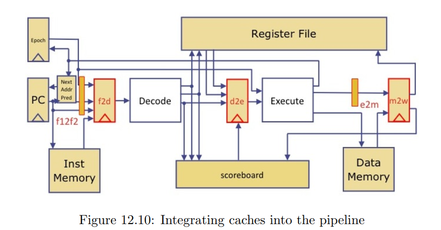


```verilog
typedef 32 CacheRows // 32行Cache
2  bit // 位对齐，pc与数据为32位 4 bytes
4  bit Offset // 16 * 32 = 512 每行512位数据 16条指令或数据
5  bit Index  // clog2(CacheRows) = 5
21 bit Tag    // 32 - 2 - 4 - 5 = 21 

ReqStatus{
    Ready			// 命中时送出数据，状态保持；未命中时 -> StartMiss
    StartMiss		// 写未命中时，如果该行dirty，将该行数据写回
    SendFillReq		// 向Memory发送请求
    WaitFillResp	// 等待Memory相应并写入Cacheline
}

MemReq{
    MemOp op   // Ld, St
    Addr  addr // typedef Bit#(32) Addr
    Date  data // typedef Bit#(32) Date
}
```


## 6.175_Lab8

Lab 8: [Riscv exceptions](http://csg.csail.mit.edu/6.175/labs/lab8-riscv-exceptions.html)

```
RISC-V Processor with Exceptions
```

- Synchronous exception occur due to some problem during a particular instruction's execution: undefined opcodes, privileged instructions attempted in user mode, arithmetic overflows, divide by zero, misaligned memory access, page faults, TLB misses, memory access protection violations, trap into the OS kernel, and so on.
- Asynchronous exception occur due to some external requiring the processor's attention: timer expiry, signal for an event of interest in an i/O device, hardware failures, power failures, and so on. 

```
同步异常是由于某个指令执行期间出现问题而发生的：未定义的操作码、在用户模式下尝试特权指令、算术溢出、除零操作、内存访问错误、页面错误、TLB 未命中、内存访问保护违规、陷入操作系统内核等。
异步异常是由于外部事件需要处理器的注意力而发生的：定时器到期、对 I/O 设备中感兴趣的事件的信号、硬件故障、电源故障等。
```


_interrupt vetor_ at a known address

On handler completion, it executes a special indirect jump instruction ERET (return from exception) which:

- enables interrupts
- restores the processor to user mode from kernel mode, and
-  restores the hardware status and control state so that instruction resumes where it left off at the interrupted instruction.


- exception handle in pipeline

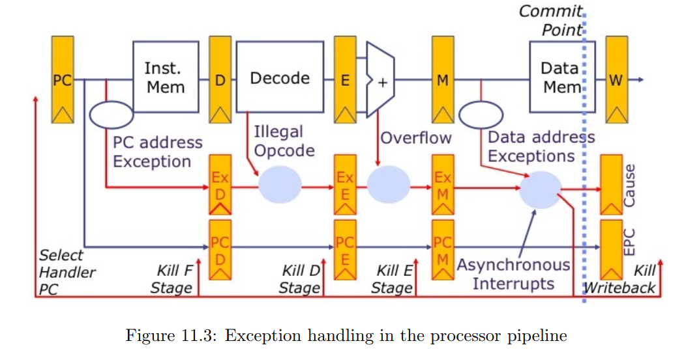


> The low 12 bits of this register store a 4-element stack of privilege/user mode (PRV) and interrupt enable (IE) bits. Each stack element is 3 bits wide. For example, `mstatus[2:0]` corresponds to the top of the stack, and contains the current PRV and IE bits. Specifically, `mstatus[0]` is the IE bit, and interrupts are enabled if IE = 1. `mstatus[2:1]` contains the PRV bits. If the processor is in user mode, it should be set to `2'b00`. If the processor is in machine (privileged) mode, it should be set to `2'b11`. Other stack elements (i.e. `mstatus[5:3], ..., mstatus[11:9]`) have the same construction.
> When an exception is taken, the stack will be "pushed" by left-shifting 3 bits. As a result, the new PRV and IE bits (e.g. machine mode and interrupt disabled) are now stored into `mstatus[2:0]`.
> Conversely, when we return from an exception using the `eret` instruction, the stack is "popped" by right-shifting 3 bits. Bits `mstatus[2:0]` will contain their original values, and `mstatus[11:9]` is assigned to (user mode, interrupt enabled)


reference:

> https://github.com/WangXuan95/BSV_Tutorial_cn
>
> https://github.com/androny1012/MIT_LAB_6.175-6.375
>
> "Computer Architecture: A Constructive Approach"  Arvind  