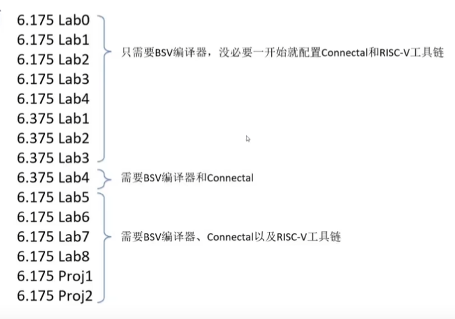

# 学习顺序





# 240310

## 安装编译器


> https://github.com/B-Lang-org/bsc/releases

下载ubuntu 22.04版本


VMware虚拟机共享文件夹需挂载

```
sudo mount -t fuse.vmhgfs-fuse .host:/ /mnt/hgfs -o allow_other
```


运行hello

```shell
huangxc@Ubuntu:~/MIT_course/BSV_learn/src/1.Hello$ bsvbuild.sh -bs mkTb Hello.bsv
-e top module: mkTb
-e top file  : Hello.bsv
-e print simulation log to: /dev/stdout
-e 
-e maximum simulation time argument:
-e 
-e bsc -sim -g mkTb -u Hello.bsv 
checking package dependencies
compiling Hello.bsv
code generation for mkTb starts
Elaborated module file created: mkTb.ba
All packages are up to date.
-e bsc -sim -e mkTb -o sim.out 
Bluesim object created: mkTb.{h,o}
Bluesim object created: model_mkTb.{h,o}
Simulation shared library created: sim.out.so
Simulation executable created: sim.out
-e 
-e ./sim.out > /dev/stdout 
Hello, World!
-e
```

