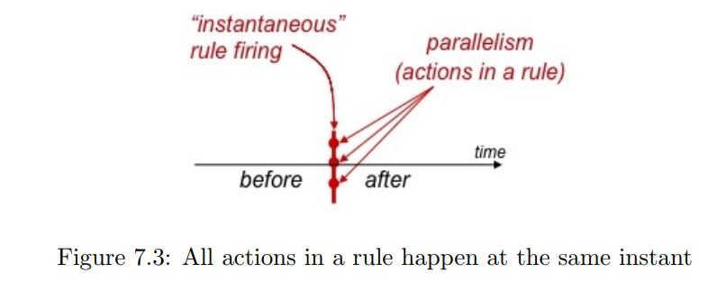

# 学习顺序


# 240310

## 安装编译器


> https://github.com/B-Lang-org/bsc/releases

下载ubuntu 22.04版本


VMware虚拟机共享文件夹需挂载

```
sudo mount -t fuse.vmhgfs-fuse .host:/ /mnt/hgfs -o allow_other
```


运行hello

```shell
huangxc@Ubuntu:~/MIT_course/BSV_learn/src/1.Hello$ bsvbuild.sh -bs mkTb Hello.bsv
-e top module: mkTb
-e top file  : Hello.bsv
-e print simulation log to: /dev/stdout
-e 
-e maximum simulation time argument:
-e 
-e bsc -sim -g mkTb -u Hello.bsv 
checking package dependencies
compiling Hello.bsv
code generation for mkTb starts
Elaborated module file created: mkTb.ba
All packages are up to date.
-e bsc -sim -e mkTb -o sim.out 
Bluesim object created: mkTb.{h,o}
Bluesim object created: model_mkTb.{h,o}
Simulation shared library created: sim.out.so
Simulation executable created: sim.out
-e 
-e ./sim.out > /dev/stdout 
Hello, World!
-e
```


# rule semantics


`simultaneous`and`parallel`: 一个rule里的all actions执行

`concurrent`: 一个clock里多个rule执行

$r_{i}$ is “earlier” than  $r_{j}$ if $ i < j$


寄存器接口

```verilog
interface Reg #(type t);
    method Action _write (t data);
    method t	  _read;
endinterface
```





- single rule semantics:  
  - Compute the values of all value expressions in the rule  
  - Compute the CAN FIRE condition for the rule.   
  - For now (single rule in isolation), let WILL FIRE = CAN FIRE  
  - Compute the EN conditions for all the action methods in the rule  
  - Perform the actions of all enabled methods (EN is true).  


寄存器，并发执行，需要满足：


`schedule`


## conclusion

- Rule semantics come in two parts: intra-rule and inter-rule.  
- Intra-rule semantics (parallel/simultaneous) is about execution of the rule body, whichis always of type Action:
  - Action composition: sequential and conditional composition, modulo well-formednessconstraints about pairs of actions that cannot be performed simultaneously.
  - Instantaneous execution of the rule body Action (which may be composed ofother Actions).
  - Execution of the rule body, which transforms a pre-Action state into a postAction state. This is logically instantaneous; there is no intermediate states.
- Inter-rule semantics (concurrency) is about the logically sequential execution of rulesaccording to a schedule:
  - Each rule fires in a clock if its CAN FIRE condition is true and if it does notconflict with rules that have previously fired in the same clock.
  - Its CAN FIRE condition is a combination of the explicit rule condition expressionand the method conditions of all the methods it invokes in the rule condition and body. The combination takes into account conditional constructs in the rule condition and body.
  - A rule conflicts with an earlier rule if one of its methods conflicts with a methodin the earlier rule (violates a method-ordering constraint) and the earlier rule fired in this clock.
  - The bsc compiler picks a schedule that attempts to maximize rule concurrency.  


## Maybe类型

`Maybe#(td)` 是 BSV 预定义的一种多态类型，他能给任意类型（设类型名为 `td`）的数据附加上“是否有效”的信息。

以下代码中，我们定义两个 Maybe 类型的变量，它们中的数据类型都是 `Int#(9)` ，一个无效，一个有效：

```
Maybe#(Int#(9)) value1 = tagged Invalid;    // 无效
Maybe#(Int#(9)) value2 = tagged Valid 42;   // 有效，取值为 42
```


BSV 针对 `Maybe#(td)` 类型提供了两个函数：

- `isValid(x)` : 接受 `Maybe#(td)` 类型的变量 `x` 作为参数：
  - `x` 无效则返回 False
  - `x` 有效则返回 True
- `fromMaybe(dv, x)` : 接受 `td` 类型的变量 `dv` 和 `Maybe#(td)` 类型的变量 `x` 作为参数：
  - `x` 无效则返回 `dv`
  - `x` 有效则返回 `x` 中的取值。

使用例：

```
let v1 = isValid(value1);           // 得到 v1 是 Bool 类型的 False
let d1 = fromMaybe(-99, value1);    // 得到 d1 是 Int#(9) 类型的 -99
let v2 = isValid(value2);           // 得到 v2 是 Bool 类型的 True
let d2 = fromMaybe(-99, value2);    // 得到 d2 是 Int#(9) 类型的 42
```


　
